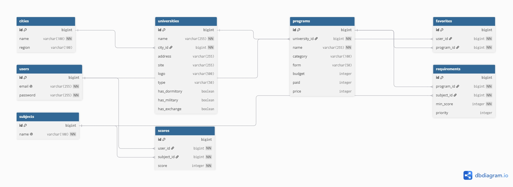

# UniPath Backend

---

## О проекте

**UniPath** — мобильное приложение - навигатор для абитуриентов, которое помогает выбрать вуз и специальность.
Репозиторий содержит серверную часть (Backend), написанную на **Java + Spring Boot**.

### Основные функции:

- Регистрация и авторизация пользователей
- Хранение и защита данных (пароли шифруются через BCrypt)
- REST API для мобильного приложения на Android
- Работа с PostgreSQL через Spring Data JPA
- Валидация данных на уровне сервера

---

## Состав команды и роли

- **Кошелев А.Д.** – тимлид / backend-разработчик
- **Василевич К.А.** – UI/UX-дизайнер и android-разработчик

---

## Структура Базы данных

---

## Примеры работы приложения

